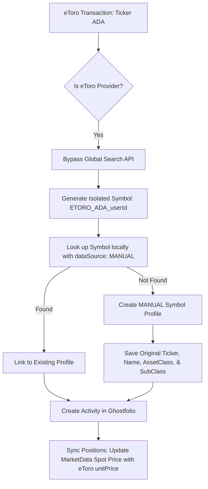

# eToro Integration Details & API Reference

This skill documents the technical details of the eToro integration, including the Public REST API endpoints, custom headers, asset type classification mappings, and the isolated `MANUAL` synchronization architecture designed to prevent ticker mapping conflicts.

---

## 1. Authentication & Base Configuration

- **API Base URL**: `https://public-api.etoro.com/api/v1`
- **Authentication Method**: Headers-based authentication using three mandatory headers:
  - `x-api-key`: API key from the eToro Developer Portal.
  - `x-user-key`: User-specific key generated in account settings under API Key Management.
  - `x-request-id`: A unique request UUID (`randomUUID()`) generated for each API call to handle idempotency.
- **Credentials Payload**: Serialized as a JSON string containing `apiKey` and `userKey`:
  ```json
  {
    "apiKey": "YOUR_API_KEY",
    "userKey": "YOUR_USER_KEY"
  }
  ```
- **Base Currency**: USD (all portfolios and asset profiles are traded and valued in US Dollars).
- **Credentials Validation**: Validated by making a test request to `GET /me`.

---

## 2. API Endpoints Reference

The following endpoints are queried by the `EtoroProvider` service:

### 1. Fetch Authenticated Profile

- **Path**: `GET /me`
- **Purpose**: Verify credentials and retrieve account identifiers (such as GCID, username, and `realCid`).
- **Account Identification**: The `realCid` (real account ID) is used as the account ID in Ghostfolio.

### 2. Fetch Portfolio & Cash Balance

- **Path**: `GET /trading/info/portfolio`
- **Purpose**: Retrieves open positions, copy trading mirrors, and overall cash balances.
- **Response Structure**:
  - **Cash Balance**: Read from the `credit` property (numeric float value).
  - **Open Positions**: Extracted from `clientPortfolio.positions[]` and copies from `clientPortfolio.mirrors[].positions[]`.
  - **CFD Filter**: Positions with `settlementTypeID === 0` (CFD derivatives) are skipped; only actual assets (`settlementTypeID !== 0`) are imported.

### 3. Fetch Trade History

- **Path**: `GET /trading/info/trade/history?minDate=YYYY-MM-DD`
- **Purpose**: Fetch closed trades. If a synchronization baseline date is specified, transactions before that timestamp are filtered out.
- **Handling**: A closed position generates two transactions in Ghostfolio: one `BUY` (using the position opening rate and time) and one `SELL` (using the closing rate and time).

### 4. Fetch Instrument Types

- **Path**: `GET /market-data/instrument-types`
- **Purpose**: Retrieves all asset classes/categories supported by eToro.
- **Response**:
  ```json
  {
    "instrumentTypes": [
      { "instrumentTypeID": 1, "instrumentTypeDescription": "Stocks" },
      { "instrumentTypeID": 5, "instrumentTypeDescription": "Cryptocurrencies" }
    ]
  }
  ```

### 5. Fetch Instruments Metadata

- **Path**: `GET /market-data/instruments?instrumentIds=1001,1003`
- **Purpose**: Resolves eToro numeric instrument IDs into human-readable display names, ticker symbols (`symbolFull`), and type IDs (`instrumentTypeID`).

---

## 3. Asset Classification Mapping

To organize your assets correctly in dashboards, eToro's `instrumentTypeDescription` is mapped to Ghostfolio's `AssetClass` and `AssetSubClass` as follows:

| eToro Category Description   | Ghostfolio AssetClass    | Ghostfolio AssetSubClass |
| ---------------------------- | ------------------------ | ------------------------ |
| **STOCKS / EQUITY**          | `EQUITY`                 | `STOCK`                  |
| **ETFS**                     | `EQUITY`                 | `ETF`                    |
| **CRYPTOCURRENCIES / COINS** | `ALTERNATIVE_INVESTMENT` | `CRYPTOCURRENCY`         |
| **COMMODITIES**              | `COMMODITY`              | `COMMODITY`              |
| **CURRENCIES / FOREX**       | `LIQUIDITY`              | `CASH`                   |
| **INDICES**                  | `EQUITY`                 | `MUTUALFUND`             |

---

## 4. Isolated MANUAL Sync Architecture

To avoid conflicts with global tickers (such as the ticker `ADA` mapping to the stock `ADAMANT Messenger` on Yahoo instead of CoinGecko's `Cardano`), eToro uses an **isolated manual sync architecture**.



### Key Implementation Details

1. **Deterministic Isolated Symbol**:
   Every imported asset is assigned a unique `SymbolProfile` in Ghostfolio using the format:
   `symbol: ETORO_${isin}_${userId}` (e.g. `ETORO_ADA_USER-1`) with `dataSource: MANUAL`.
2. **Metadata Preservation**:
   Although it is marked as a `MANUAL` profile, the original ticker (e.g., `ADA`) is saved in the `isin` field, the original asset class/subclass are saved in `assetClass`/`assetSubClass`, and the profile is scoped to the specific user via `userId`.
3. **Valuation Updates**:
   During synchronization, position unit prices returned directly from eToro's `/trading/info/portfolio` are written as the current spot price (`INTRADAY` state) in the `MarketData` table for these custom symbols. This completely bypasses the need for external scraping.
