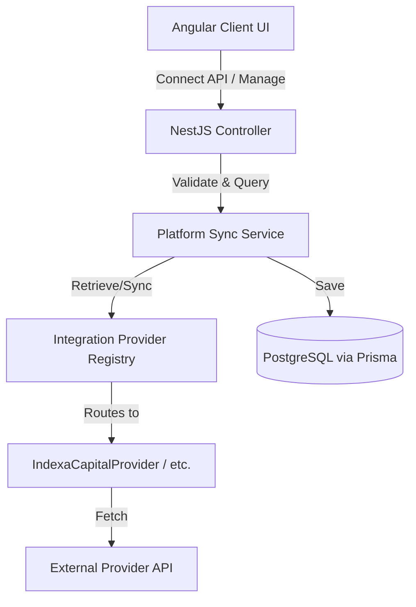

# Ghostfolio Platform Integrations Architecture & Development Guide

This skill details how Ghostfolio implements native API-based platform integrations to synchronize user assets, portfolios, cash balances, and historical transactions automatically.

---

## 1. Architectural Overview

Integrations in Ghostfolio follow a modular architecture consisting of the following layers:



### Data Model (`prisma/schema.prisma`)

The core model governing platform connections is `PlatformIntegration`:

- **`provider`** (Enum `IntegrationProvider`): Identifies the platform (e.g. `INDEXA_CAPITAL`).
- **`encryptedCredentials`**, **`credentialsIv`**, **`credentialsTag`**: Encrypted API secrets (tokens/keys) handled securely using AES-256-GCM.
- **`externalAccountId`**: Unique identifier for the account on the provider's system (to link multiple portfolios).
- **`accountId` / `userId`**: Reference to the linked Ghostfolio `Account` and `User`.
- **`lastSyncStatus`** (`PENDING`, `SUCCESS`, `ERROR`, `SYNCING`) and **`lastSyncError`**: Synchronization logs.

---

## 2. Directory Layout & File Reference

When adding or modifying an integration, these are the directories and files to work with:

### Shared Library

- **[integration-registry.ts](file:///Users/ballesterosam/Personal/projects/ghostfolio/libs/common/src/lib/integration-registry.ts)**: Static metadata definitions (`SUPPORTED_INTEGRATIONS`) for the UI layout: name, url, credentials fields, descriptions, and connection steps.
- **[interfaces](file:///Users/ballesterosam/Personal/projects/ghostfolio/libs/common/src/lib/interfaces/platform-integration.interface.ts)**: Shared interfaces for credentials field configurations and transfer response types.

### Backend (NestJS API)

- **[platform-integration.controller.ts](file:///Users/ballesterosam/Personal/projects/ghostfolio/apps/api/src/app/platform-integration/platform-integration.controller.ts)**: Endpoint routing for connect, disconnect, and manual sync commands.
- **[integration-provider.registry.ts](file:///Users/ballesterosam/Personal/projects/ghostfolio/apps/api/src/services/platform-integration/integration-provider.registry.ts)**: Central registration map matching enum keys to provider service instances.
- **[providers/](file:///Users/ballesterosam/Personal/projects/ghostfolio/apps/api/src/services/platform-integration/providers/)**: Subdirectory hosting specific API connector implementations (e.g. `indexa-capital.provider.ts`).
- **[logo.service.ts](file:///Users/ballesterosam/Personal/projects/ghostfolio/apps/api/src/app/logo/logo.service.ts)**: Intercepts queries for the provider's domain to load a local logo asset from the filesystem instead of making external internet calls.

### Frontend (Angular Client)

- **[add-integration-dialog/](file:///Users/ballesterosam/Personal/projects/ghostfolio/apps/client/src/app/pages/accounts/add-integration-dialog/)**: Modal wizard managing the multi-step connection UI (Provider Selection Grid, Credentials Configuration, Connection status loading/success).

---

## 3. Developing a New Platform Integration (Step-by-Step)

Follow these steps to add a new API integration to Ghostfolio:

### Step 1: Update the Prisma Schema

1. Add the new provider identifier to the `IntegrationProvider` enum in `prisma/schema.prisma`.
2. Generate typings and run database updates:
   ```bash
   npm run database:generate-typings
   npm run database:push
   ```

### Step 2: Implement the Provider Logic

Create a new provider class under `apps/api/src/services/platform-integration/providers/<provider-name>/` implementing `IntegrationProviderInterface`:

- **`getProviderName()`**: Return the matching enum key.
- **`validateCredentials(credentials)`**: Verify API token connectivity.
- **`getAccounts(credentials)`**: Retrieve portfolios/accounts available for the user.
- **`getPositions(credentials, externalAccountId)`**: Fetch current asset/instrument allocations.
- **`getCashBalance(credentials, externalAccountId)`**: Fetch current cash balance.
- **`getTransactions(credentials, externalAccountId, since?)`**: Retrieve buys/sells since last sync date.

### Step 3: Register the Provider in the Backend

Inject and set your new provider instance in `IntegrationProviderRegistry` constructor (`apps/api/src/services/platform-integration/integration-provider.registry.ts`).

### Step 4: Add Metadata to the Integration Registry

Update `SUPPORTED_INTEGRATIONS` in `libs/common/src/lib/integration-registry.ts` with details on:

- Provider enum, display name, and URL.
- Setup instructions and input credential fields (types, placeholders, and descriptions).

### Step 5: Save and Configure Local Logo

1. Save a resized brand PNG icon under `apps/api/src/assets/`.
2. Add an interception check in `LogoService.getLogoByUrl(aUrl)` in `apps/api/src/app/logo/logo.service.ts` to load your local file and prevent any external favicon fetches.
3. Stage/add the new PNG file in git.

---

## 4. Verification Checklist

To confirm your implementation is correct:

1. Run backend unit tests: `npm run test:api`
2. Verify frontend compilation: `npx nx build client`
3. Check appearance in dark-mode and verify tooltips in the integrations grid.
